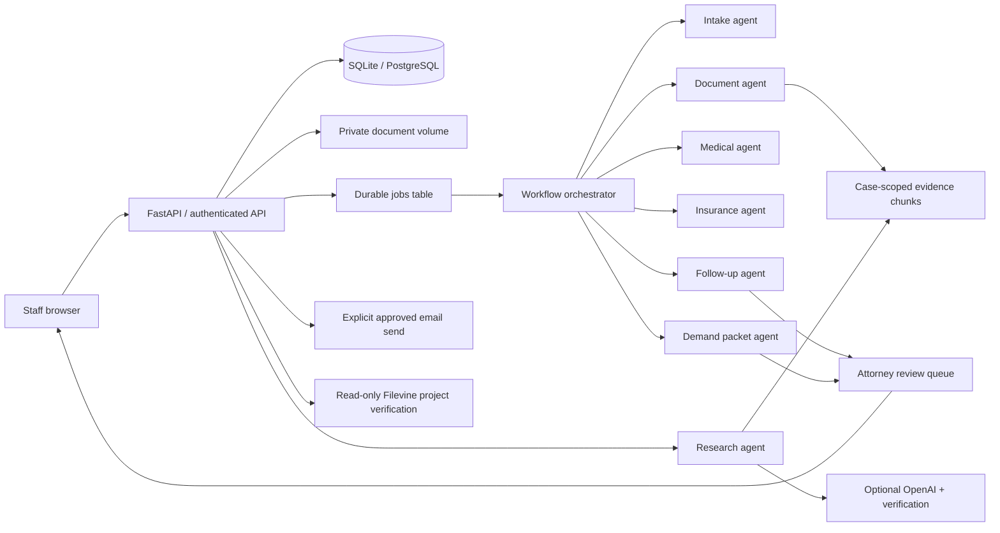

<!-- Purpose: explain component boundaries, data ownership, workflows and scaling limits. -->
# Arav Case Operations architecture

This is a runnable single-firm case operations application. It manages the local workflow from intake to closure, and supports optional AI research and approved SMTP delivery. It is not a legal decision engine or a completed enterprise Filevine replacement.

## Repository responsibilities

| Folder | Responsibility |
| --- | --- |
| `backend/` | HTTP routes, validation, sessions, roles, transitions and app lifecycle |
| `frontend/` | Responsive browser UI, local ES modules, reusable forms and views |
| `database/` | Relational schema, sessions, migrations and fictional demo bootstrap |
| `orchestrator/` | Persist jobs, atomic claim, execute, record failures and periodic monitoring |
| `sub_agents/` | Narrow intake/document/medical/insurance/follow-up/research/demand workers |
| `prompts/` | Versioned research and independent verification instructions |
| `integrations/` | OpenAI, SMTP and Filevine provider boundaries |
| `scripts/` | Windows setup/start/tests, account maintenance and local backup |
| `tests/` | API workflow, security, duplicate handling and evidence regressions |
| `docs/` | Setup, architecture, integrations and release limitations |

The frontend uses browser-native JavaScript modules. No Node build or separate frontend server is needed. This keeps the installation small and uses one origin for sessions and CSRF protection. The API can also serve another frontend through the documented routes.

## Agents and control

Agents are bounded Python workers. Intake, date-gap checks and side-effect orchestration are deterministic code because these operations do not need LLM judgment. The research agent uses retrieval and optionally a structured LLM answer plus a second verification call. The server checks quoted text and source IDs independently. A successful verifier is not proof of legal or clinical correctness; the original source remains available for inspection.

Every persisted job has status, attempt count, timestamps and error text. SQL compare-and-set claims prevent two workers from claiming the same job. Local agent database changes commit together. Failed jobs require explicit retry. Collection tasks have unique keys; replaying the same workflow does not duplicate them. Stale running jobs become failed after 30 minutes, requiring review.

Run **one worker** per installation: either the default embedded worker in a single Uvicorn process, or `WORKER_ENABLED=false` with one separate `python -m orchestrator.worker` process. Multiple web processes need the separate worker and PostgreSQL. Scheduler deduplication and the login throttle are not distributed; use a gateway throttle before multi-process deployment.

SMTP delivery is outside the database transaction. The API first claims an approved draft as `sending`. A known success becomes `sent`; demo delivery becomes `simulated`. An exception becomes `delivery_unknown`, and a crash may leave `sending`. Both require checking the provider before manual reconciliation. There is intentionally no automatic retry of externally uncertain sends.

## Evidence and storage

Document uploads use generated storage names and case-specific SHA-256 duplicate detection. The original file stays outside the static frontend directory. PDF page numbers are retained; text and DOCX references are logical sections because DOCX has no fixed page geometry. Any unreadable PDF page rejects the entire extraction, preventing a partial medical record from looking complete.

Chunks are stored in the relational database with mandatory case IDs. Keyword ranking works offline. Optional OpenAI embeddings add cosine similarity, with vectors stored in JSON in the same database; this version does **not** require or claim a Qdrant deployment. Enable embeddings before uploading your evidence, and keep the embedding model fixed for the database. Existing keyword-only documents need explicit reindexing in a future maintenance workflow if semantic retrieval is enabled later.

## Roles and legal gates

All active staff belong to one firm and can read all cases in that installation. Paralegals may create cases, upload documents, update tracking and run local workflows. Attorneys and admins can approve drafts, send approved emails and change stages. Only admins create staff. Access control is enforced by the API, not merely hidden buttons.

Stage sequence: intake → documents → treatment → demand → negotiation → settled → closed. Documents, treatment, demand and negotiation may enter litigation. Litigation can proceed to settlement or closure. Demand requires treatment complete plus indexed medical, bills and insurance documents. Negotiation requires an approved demand packet. Settlement needs a positive amount and a reviewer rationale. The application does not invent deadlines or automatically determine legal eligibility.

## Scale and deployment boundaries

SQLite is for local evaluation or small single-process use. PostgreSQL is configured for deployment. File blobs need an encrypted persistent volume with backups. Current search loads one case's chunks into memory; high-volume evidence should move to a filtered vector index. The dashboard/list endpoints are capped, and this version is not load-certified for 1,000 concurrent cases/users. Add queue capacity controls, distributed rate limiting, observability, per-matter access, SSO/MFA and firm-specific retention before enterprise rollout.
